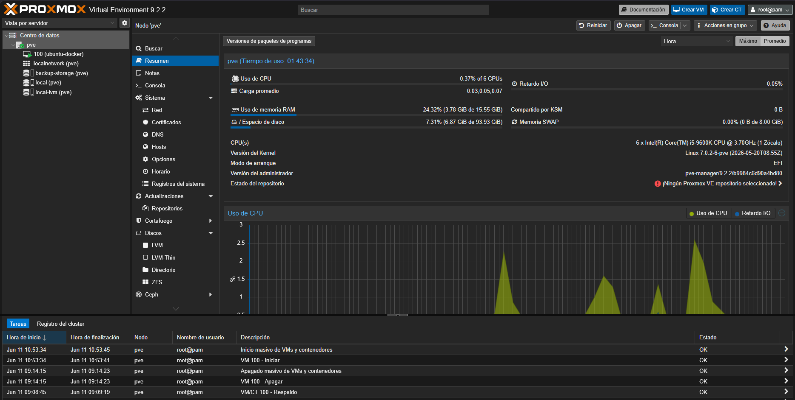
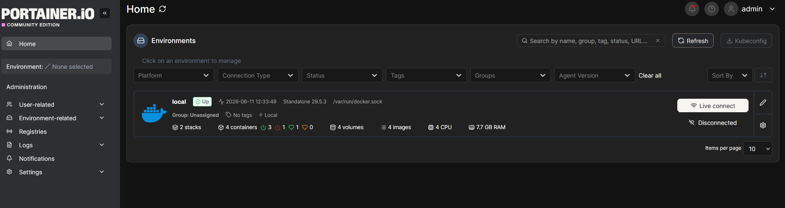
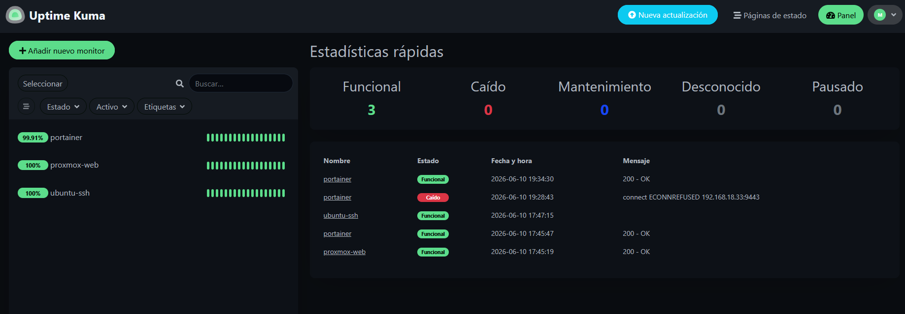

# Homelab Proxmox + Docker

Proyecto personal de homelab creado a partir de un PC de torre reutilizado como servidor.

El objetivo del proyecto es aprender administración de sistemas, virtualización, Linux, Docker, monitorización, backups y despliegue de servicios self-hosted, documentando todo el proceso como portfolio técnico.

## Hardware utilizado

| Componente | Detalle              |
| ---------- | -------------------- |
| CPU        | Intel Core i5-9600K  |
| RAM        | 16 GB                |
| SSD        | Kingston A400 480 GB |
| HDD        | Toshiba HDWD110 1 TB |
| Red        | Ethernet             |
| Hypervisor | Proxmox VE 9.2.2     |

## Arquitectura actual

```text
Servidor físico
└── Proxmox VE
    └── VM Ubuntu Server
        └── Docker
            ├── Portainer
            ├── Uptime Kuma
            └── Nginx Proxy Manager
```

## Servicios desplegados

| Servicio            | Función                              |
| ------------------- | ------------------------------------ |
| Proxmox VE          | Virtualización del servidor          |
| Ubuntu Server       | Máquina virtual principal            |
| Docker              | Ejecución de contenedores            |
| Portainer           | Gestión visual de Docker             |
| Uptime Kuma         | Monitorización de servicios          |
| Nginx Proxy Manager | Reverse proxy y gestión web          |
| backup-storage      | Almacenamiento dedicado para backups |

## Estado del proyecto

* [x] Instalación de Proxmox VE
* [x] Creación de VM Ubuntu Server
* [x] Configuración SSH
* [x] Instalación de Docker
* [x] Despliegue de Portainer
* [x] Despliegue de Uptime Kuma
* [x] Despliegue de Nginx Proxy Manager
* [x] Configuración de snapshot base
* [x] Configuración de almacenamiento para backups
* [x] Primer backup funcional
* [ ] Documentación completa del proceso
* [ ] Red Docker interna
* [ ] HTTPS y dominio
* [ ] Automatizaciones

## Capturas

### Proxmox



### Portainer



### Uptime Kuma



## Aprendizajes obtenidos

Durante este proyecto he trabajado con:

- Virtualización mediante Proxmox VE
- Creación y administración de máquinas virtuales
- Administración básica de Ubuntu Server
- Acceso remoto mediante SSH
- Docker y Docker Compose
- Gestión de contenedores con Portainer
- Monitorización con Uptime Kuma
- Reverse Proxy con Nginx Proxy Manager
- Snapshots de máquinas virtuales
- Backups automatizados en Proxmox
- Documentación y control de versiones con Git y GitHub

## Objetivo profesional

Este repositorio forma parte de mi proceso de aprendizaje y portfolio para reforzar competencias en administración de sistemas, infraestructura, redes, Linux, Docker y servicios self-hosted.
